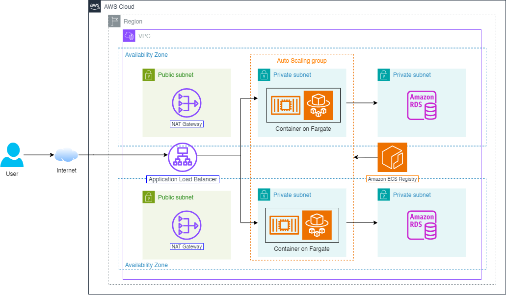

# Deploy single service with AWS Elastic Container Service and Application Load Balancer

## 1. Overview
This repository contains the workshop materials for the first workshop in the First Cloud Journey Bootcamp 2024. The workshop is designed to help you understand the basics of containerized application, particularly AWS Elastic Container Service, AWS Elastic Container Registry, AWS Fargate, Application Load Balancer and how to deploy a single service application on AWS ECS.

[Link to the workshop]([Workshop01/Workshop01.md](https://stillxthahn-workshop-01.vercel.app/))

Services: **AWS Elastic Container Service**, **AWS Elastic Container Registry**, **AWS Fargate**, **Application Load Balancer**, **AWS RDS**

## 2. Modules explanation
### 1. Introduction
   
This module will introduce you to the workshop and the services that will be used in the workshop.

### 2. Preparation

This module will guide you through the prerequisites for the workshop.

- VPC
- Subnets
- Internet Gateway
- NAT Gateway
- Route tables
- Security groups

### 3. Create database with RDS

This module will guide you through creating a database with Amazon RDS.

- Create database subnet group

  - Creating a database subnet group with Amazon RDS
- Create database instances
  - Creating a database with Amazon RDS
- Connect to the database
  - Testing connection to RDS with MySQL Workbench and dump data to the database.

### 4. Deploy single service on ECS

This module will guide you through deploying a single service application on AWS ECS.

- Prerequisite

  - Cloning github repository and generating account credentials
- Push image to ECR
  - Building Docker image, pushing it to Amazon ECR using AWS CLI
- Create Application Load Balancer
  - Configuring Application Load Balancer, Target group
- Create ECS Cluster
  - Creating ECS Cluster, Task Definition
- Create service
  - Creating a single service with created Task Definition and testing

### 5. Clean up

This module will guide you through cleaning up the resources created in the workshop.

### Thank you for reading!